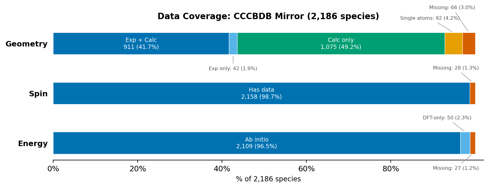

# NIST CCCBDB Database Mirror

[](LICENSE)
[](https://www.python.org/downloads/)
[](#data-coverage)
[-orange.svg)](https://cccbdb.nist.gov)

A local mirror of the [NIST Computational Chemistry Comparison and Benchmark Database (CCCBDB)](https://cccbdb.nist.gov) — **2,186 species** with molecular geometry, spin multiplicity, and total energy data across up to 42 methods and 32 basis sets. Archived as raw HTML (ground truth) and parsed into per-molecule JSON + a flat CSV for programmatic access.

> **Note:** This repository is ~700 MB due to archived HTML source pages that serve as ground truth for all parsed data.

## Why This Mirror?

CCCBDB is a valuable public-domain resource, but it was designed for interactive browsing, not programmatic access:

- **No API.** Data is served through ASP.NET pages that require server-side sessions and sequential navigation. Extracting data for even a single molecule requires multiple HTTP requests in the correct order.
- **Unreliable availability.** During our February 2026 archival run (25,000+ requests), 4.6% failed — mostly HTTP 500 errors on calculated geometry pages. See the [server status report](data/fetch_stats/SERVER_STATUS.md) for details.
- **Not reproducible.** CCCBDB can change between releases with no changelog. This mirror pins Release 22 (May 2022) with archived HTML so results are traceable to the exact source page.

This mirror solves all three: download once, query locally, cite a fixed version.

## Quick Start

Three access formats, from lightest to most complete:

| Format | Size | Contents |
|--------|------|----------|
| `cccbdb-selected-energy.csv` | 0.7 MB | Flat CSV, one row per species, 20 selected columns |
| `cccbdb-molecules.json.gz` | 3.8 MB | All parsed data for all 2,186 species (gzipped JSON) |
| `data/molecules/` | 27 MB JSON + 597 MB HTML | Per-molecule JSON + archived source HTML pages |

### Lightweight Download

If you only need the parsed data (no HTML archives), download `cccbdb-molecules.json.gz` (3.8 MB) — it contains the same data as all 2,186 individual `molecule.json` files combined:

```python
import gzip, json

with gzip.open("cccbdb-molecules.json.gz", "rt", encoding="utf-8") as f:
    db = json.load(f)

water = db["H2O_7732185"]
print(water["spin"])           # {'S_squared': 0.0, 'closed_shell': True, 'multiplicity': 1, ...}
print(water["energy"]["hf_sto3g"])  # -74.965901
print(len(db))                 # 2186
```

Regenerate both the CSV and combined JSON with `python scripts/export_csv.py`.

## Data Coverage

Data fetched February 13–16, 2026 from CCCBDB Release 22 (May 2022).



66 missing geometries are due to upstream CCCBDB gaps or server errors ([details](data/suspected_errors/DATA_GAPS_AUDIT.md)). 50 species have only DFT energies, which are archived in the per-molecule JSON but excluded from processed outputs (CSV, coverage counts) because DFT does not converge systematically to the exact answer. For CCCBDB server reliability during fetching, see the [server status report](data/fetch_stats/SERVER_STATUS.md).

## Methodology

### Archival Process

CCCBDB uses server-side ASP.NET sessions: the initial request establishes which molecule is being queried, and all subsequent pages use that session. Requests are rate-limited at 2 seconds between requests.

For each species, the following pages are archived:

1. `expgeom2x.asp` — establishes session + experimental geometry
2. `geom2x.asp` — summary of available calculated methods
3. `geom3x.asp` — calculated Cartesian coordinates for the best non-DFT method
4. `spin2x.asp` — spin expectation values ⟨S²⟩
5. `energy2x.asp` — total energies across all methods and basis sets

Six fetch campaigns over February 13–16, 2026 made 25,042 total HTTP requests, achieving the coverage reported above. See the [server status report](data/fetch_stats/SERVER_STATUS.md) for per-campaign statistics and error analysis.

### Validation

Parsed data is validated at multiple levels:

- **Formula-based atom count validation**: Element counts from parsed XYZ coordinates are checked against the molecular formula. Mismatches trigger fallback parsing or discard.
- **Electron parity checks**: Odd-electron species cannot be singlet (closed shell). The parser returns `None` rather than store an impossible spin state.
- **Internal coordinate cross-validation**: Where CCCBDB provides both Cartesian and internal coordinates, bond lengths are compared with a 0.35 Å tolerance (accounting for different geometry types: r₀, rₑ, rₛ).
- **Gold-standard spot checks**: Tier 2 tests in `verify_archive.py` compare parsed values against independently verified reference data.
- **105 automated tests**: Formula parsing (89 tests) and data integrity cross-validation (16 tests), runnable with `pytest tests/`.

### Anomaly Investigation Protocol

Every suspicious result is investigated with competing hypotheses and 3+ independent evidence sources (electron count, spin page text, energy methods, URL parameters, other species entries) before classifying as upstream error or parser bug. Full evidence for all 19 investigated anomalies is in [`ANOMALY_LOG.md`](data/suspected_errors/ANOMALY_LOG.md). Raw anomaly data is in [`anomalies.json`](data/suspected_errors/anomalies.json). Data gap classification and fetch campaign evidence is in [`DATA_GAPS_AUDIT.md`](data/suspected_errors/DATA_GAPS_AUDIT.md).

## CSV Quick Reference

`cccbdb-selected-energy.csv` at the repo root provides a flat, one-row-per-species summary (2,186 rows, 20 columns). Selection philosophy: experimental geometry preferred over best *ab initio* (DFT excluded); spin from highest-level method; energy as a cheapest + best pair. For the full set of up to 42 methods × 32 basis sets per species, use the per-molecule JSON files.

| Field | Description | Source | Notes |
|-------|-------------|--------|-------|
| `species_id` | Unique ID | Derived | `{formula}{charge}_{casno}` |
| `formula` | Hill-order formula | CCCBDB `listallx.asp` | Hill-normalized |
| `name` | Common name | CCCBDB `listallx.asp` | |
| `casno` | CAS registry number | CCCBDB `listallx.asp` | Digits only, no dashes |
| `charge` | Net charge | CCCBDB `listallx.asp` | |
| `point_group` | Molecular symmetry | CCCBDB `expgeom2x.asp` | From geometry page header. Blank (5.0%) if no geometry page |
| `multiplicity` | Spin multiplicity 2S+1 | Derived | From S² + electron parity. Blank (1.9%) if no spin data |
| `s_squared` | S² expectation value | CCCBDB `spin2x.asp` | Best method (CCSD(T) preferred). Blank (1.9%) if no spin data |
| `closed_shell` | All electrons paired | CCCBDB `spin2x.asp` | 1=yes, 0=no. Blank (1.9%) if no spin data |
| `n_electrons` | Total electrons | Derived | sum(Z × count) − charge |
| `n_atoms` | Atom count | Derived | From formula |
| `geometry_source` | Origin of coordinates | Derived | `experimental`, `calculated`, or `single atom`; blank (3.0%) if multi-atom with no geometry |
| `geometry_method` | Method/basis if calculated | Derived | CCSD(T)>CCSD>MP, largest basis, DFT excluded. Blank for experimental / single atom / missing |
| `xyz` | Cartesian coordinates (Å) | CCCBDB `expgeom2x.asp` or `geom3x.asp` | Single atoms at origin; blank (3.0%) if multi-atom with no geometry |
| `cheapest_energy_method` | Lowest-cost method | Derived | HF preferred; falls back to MP2, MP3, etc. Blank (3.5%) if no ab initio energy |
| `cheapest_energy_basis` | Smallest basis for that method | Derived | STO-3G preferred; ranked by basis set size (STO-3G→daug-cc-pVQZ); see `BASIS_RANK` in `export_csv.py` |
| `cheapest_energy` | Energy (hartree) | CCCBDB `energy2x.asp` | Blank (3.5%) if no ab initio energy |
| `best_energy_method` | Highest-level correlated method | Derived | CCSD(T)>CCSD>QCISD(TQ)>QCISD(T)>QCISD>MP4>MP3>MP2; =FULL variants ranked above frozen-core |
| `best_energy_basis` | Largest basis for that method | Derived | Ranked by basis set size; see `BASIS_RANK` in `export_csv.py`. Blank (4.2%) if no post-HF energy |
| `best_energy` | Energy (hartree) | CCCBDB `energy2x.asp` | Blank (4.2%) if no post-HF energy |

Source key:
- **CCCBDB `page.asp`** — parsed directly from the named CCCBDB page
- **Derived** — computed by this mirror's scripts from other fields

## Per-Molecule JSON: Full Data

Each species has a directory in `data/molecules/<formula>_<casno>/` containing `molecule.json` and archived HTML pages.

```
data/molecules/
├── H2O_7732185/
│   ├── molecule.json
│   ├── expgeom2x.html
│   ├── geom2x.html
│   ├── geom3x.html
│   ├── spin2x.html
│   ├── energy2x.html
│   └── pubchem.json
├── CH4_74828/
│   └── ...
└── ...  (2,186 directories)
```

### JSON Schema

```json
{
  "formula": "H2O",
  "name": "Water",
  "casno": "7732185",
  "charge": 0,
  "fetched_date": "2026-02-16",
  "point_group_cccbdb": "C2v",

  "geometries": {
    "experimental": {
      "xyz": "O 0.000000 0.000000 0.117300\nH 0.000000 0.757200 -0.469200\nH 0.000000 -0.757200 -0.469200",
      "point_group": "C2v",
      "n_atoms": 3,
      "geometry_type": "equilibrium",
      "source_url": "https://cccbdb.nist.gov/expgeom2x.asp?casno=7732185&charge=0"
    },
    "experimental_internal_coords": {
      "distances": [{"description": "rOH", "value": 0.958, "atoms": [1, 2],
                     "reference": "1979Hoy/Bun:1", "comment": "re"}],
      "angles": [{"description": "aHOH", "value": 104.4776, "atoms": [2, 1, 3],
                  "reference": "1979Hoy/Bun:1", "comment": "re"}],
      "dihedrals": []
    },
    "calculated": {
      "METHOD": { "BASIS": { "xyz": "...", "point_group": "...", "n_atoms": 3 } }
    },
    "best_available": "experimental"
  },

  "spin": {
    "S_squared": 0.0,
    "closed_shell": true,
    "multiplicity": 1,
    "source_url": "https://cccbdb.nist.gov/spin2x.asp"
  },

  "energy": {
    "hf_sto3g": -74.965901,
    "methods": {
      "HF":       { "STO-3G": -74.965901, "cc-pVTZ": -76.05777, "...": "..." },
      "CCSD(T)":  { "cc-pVTZ": -76.332216, "...": "..." },
      "B3LYP":    { "cc-pVTZ": -76.459841, "...": "..." }
    },
    "basis_sets": ["STO-3G", "3-21G", "6-31G", "cc-pVDZ", "cc-pVTZ", "..."],
    "source_url": "https://cccbdb.nist.gov/energy2x.asp"
  },

  "properties": {
    "n_electrons": 10,
    "molecular_weight": 18.015,
    "n_atoms": 3
  }
}
```

#### Null semantics

| Field | `null` means | `{}` means |
|-------|-------------|------------|
| `spin` | Not yet attempted, or session failure detected and cleared | Attempted; no spin data exists on CCCBDB for this species |
| `energy` | Not yet attempted (bootstrap skeleton) | — |
| `geometries.experimental` | No experimental geometry on CCCBDB | — |
| `geometries.best_available` | No geometry available (experimental or calculated) | — |

> After a complete fetch run (`--pages all`), no species should have `null` for `spin` or `energy` — every species will have either `{}` (no data on CCCBDB) or a populated dict. `null` values indicate the fetch has not yet been run or was interrupted before reaching that species.

Known upstream data anomalies (19 investigated) and all parser corrections are documented in [`ANOMALY_LOG.md`](data/suspected_errors/ANOMALY_LOG.md) with evidence and verification instructions. Machine-readable anomaly data is in [`anomalies.json`](data/suspected_errors/anomalies.json).

<details>
<summary><h2>Available Methods and Basis Sets</h2></summary>

Not every method/basis combination is available for every species. Each molecule's `energy.basis_sets` lists its available basis sets, and `energy.methods` contains only the methods with data.

### Computational Methods

**Ab initio (23):**

| Method | Notes |
|--------|-------|
| HF | Hartree-Fock |
| ROHF | Restricted open-shell Hartree-Fock |
| MP2, MP2=FULL | 2nd-order Moller-Plesset |
| PMP2 | Projected (spin-contamination-corrected) MP2 |
| MP3, MP3=FULL | 3rd-order Moller-Plesset |
| MP4, MP4=FULL | 4th-order Moller-Plesset |
| ROMP2 | Restricted open-shell MP2 |
| CID, CID=FULL | Configuration interaction doubles |
| CISD | Configuration interaction singles+doubles |
| CCD | Coupled cluster doubles |
| CCSD, CCSD=FULL | Coupled cluster singles+doubles |
| CCSD(T), CCSD(T)=FULL | CCSD with perturbative triples |
| QCISD | Quadratic CI singles+doubles |
| QCISD(T), QCISD(T)=FULL | QCISD with perturbative triples |
| QCISD(TQ), QCISD(TQ)=FULL | QCISD with perturbative triples+quadruples |

**DFT (15 + 4 ultrafine grid variants):**

| Method | Notes |
|--------|-------|
| LSDA | Local spin density approximation |
| BLYP | Becke-Lee-Yang-Parr |
| B1B95 | Becke 1-parameter with B95 correlation |
| B3LYP | Becke 3-parameter LYP hybrid |
| B3PW91 | Becke 3-parameter PW91 |
| mPW1PW91 | Modified Perdew-Wang 1-parameter |
| M06-2X | Minnesota 06-2X |
| PBEPBE | Perdew-Burke-Ernzerhof GGA |
| PBE1PBE | PBE0 hybrid |
| HSEh1PBE | Heyd-Scuseria-Ernzerhof screened hybrid |
| TPSSh | TPSS hybrid meta-GGA |
| wB97X-D | Range-separated hybrid with dispersion |
| B97D3 | B97 with D3 dispersion |
| B2PLYP, B2PLYP=FULL | Double-hybrid (MP2 + DFT) |

Ultrafine grid variants: `B3LYPultrafine`, `PBEPBEultrafine`, `B2PLYP=FULLultrafine`, `B97D3ultrafine`

`=FULL` means all electrons are correlated (no frozen core). Ultrafine variants use a denser integration grid.

### Basis Sets (32)

| Basis Set | Type |
|-----------|------|
| STO-3G | Minimal |
| 3-21G, 3-21G* | Split-valence |
| 6-31G, 6-31G*, 6-31G**, 6-31+G** | Pople double-zeta |
| 6-311G*, 6-311G** | Pople triple-zeta |
| 6-31G(2df,p), 6-311+G(3df,2p), 6-311+G(3df,2pd) | Pople extended polarization |
| TZVP | Ahlrichs triple-zeta |
| cc-pVDZ, cc-pVTZ, cc-pVQZ | Dunning correlation-consistent |
| cc-pV(D+d)Z, cc-pV(T+d)Z, cc-pV(Q+d)Z | Tight-d augmented |
| aug-cc-pVDZ, aug-cc-pVTZ, aug-cc-pVQZ | Augmented (diffuse functions) |
| aug-cc-pV(T+d)Z, aug-cc-p(Q+d)Z | Augmented tight-d |
| cc-pCVDZ, cc-pCVTZ, cc-pCVQZ | Core-valence correlation |
| aug-cc-pCVTZ | Augmented core-valence |
| Sadlej\_pVTZ | Sadlej polarized (electric properties) |
| daug-cc-pVDZ, daug-cc-pVTZ, daug-cc-pVQZ | Doubly augmented |

</details>

## License

The mirror scripts are released under the [MIT License](LICENSE). The underlying CCCBDB data is a public domain U.S. Government work and is not subject to copyright.

## Citation

If you use this data in your research, please cite both this mirror and the original CCCBDB. See [CITATION.cff](CITATION.cff) for citation metadata.

> NIST Computational Chemistry Comparison and Benchmark Database,
> NIST Standard Reference Database Number 101,
> Release 22, May 2022, Editor: Russell D. Johnson III,
> https://cccbdb.nist.gov/, https://doi.org/10.18434/T47C7Z
